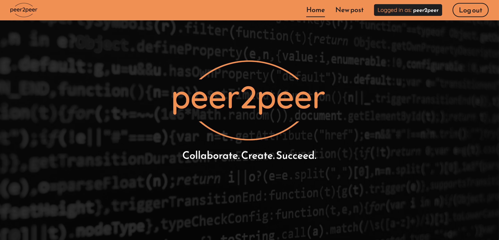
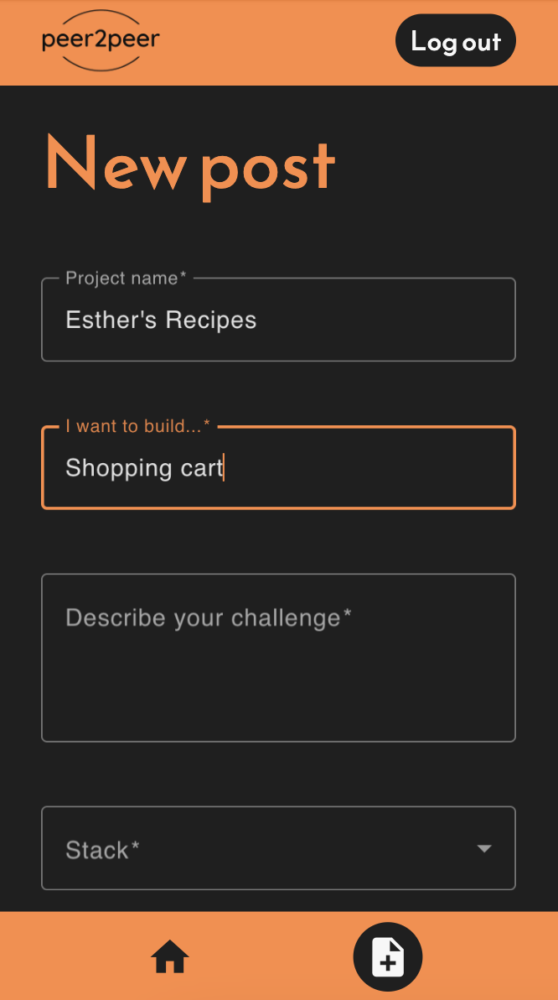
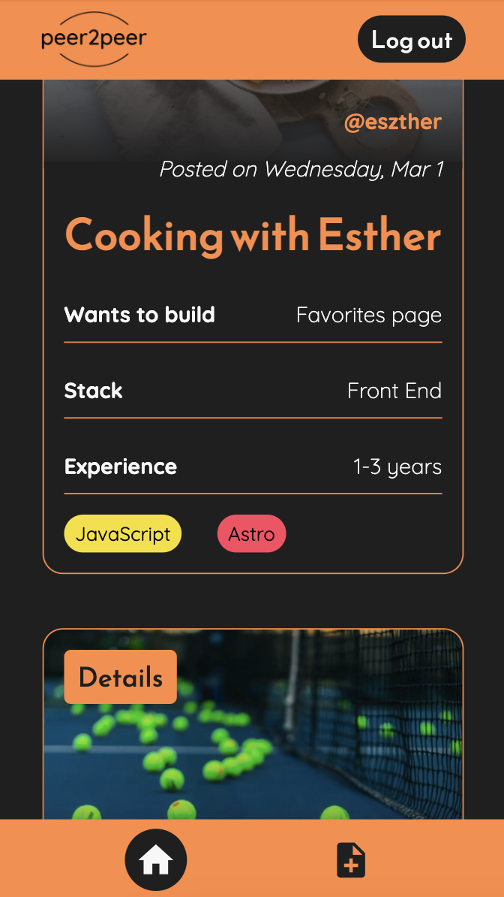
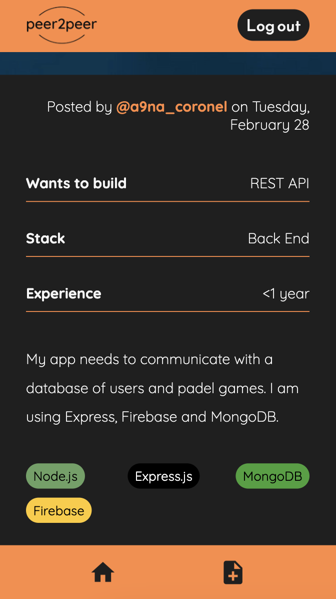
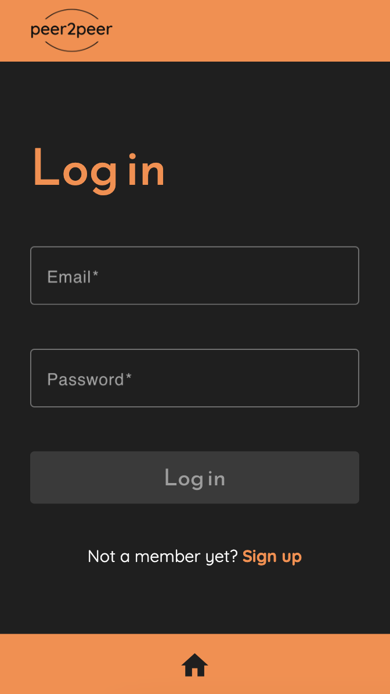
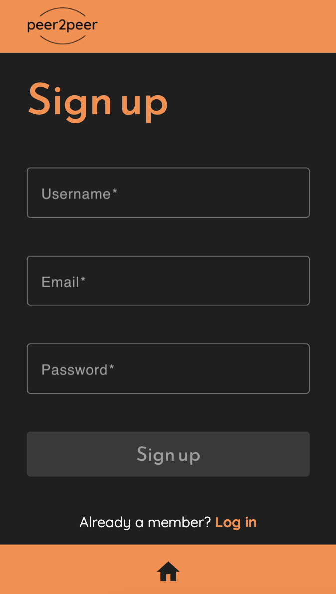

# peer2peer

Peer2peer is a platform where programmers can connect and organize pair-programming sessions.

[Click here to see the live demo](https://inge-heeringa-final-project-2023-bcn.netlify.app/)

#### SonarCloud Metrics

This web application is written in TypeScript and built with the MEAN stack. It relies on Angular on the front end, combined with NgRx to ensure a consistent state across various components.

The Material Angular library provides a sleek and professional look for the UI, while Sass is used for CSS preprocessing.

On the backend, I use Node.js with Express and MongoDB to provide a scalable and efficient infrastructure for storing and processing data. ([Click here to see the back-end code.](https://github.com/isdi-coders-2023/Inge-Heeringa-Final-Project-back-202301-bcn))

My testing suite includes Jest, Supertest and Angular Testing Library to ensure the application is functioning correctly and to instill confidence in my users that they can use the application with minimal risk of encountering bugs or errors.

## Features

### Posting requests

One of the key features of peer2peer is the ability for users to post requests for pair programming on certain features of their projects. Users introduce their project name and a brief description, and list the stack and technologies they are using. By indicating their level of experience, they guide other users to identify the best candidates for collaboration.

  

### User authentication

I used JSON Web Token (JWT) for secure user authentication. By implementing JWT, my application ensures that sensitive data is stored safely and that only authorized users can access protected routes and features.

 

### Image storage and optimization

One key area I focused on during development was performance, specifically optimizing images using Sharp. The result is a high-performing application that loads quickly. In addition, I chose Supabase as the application's cloud storage solution to provide secure and scalable storage for images.

## Future implementations

- Filter requests by stack, technologies and level of experience
- Interaction between users through direct messaging
- Schedule pair programming sessions in a shared calendar
- Redirect users to their platform of choice to connect and hold their pair programming session

## Getting started

To get started using peer2peer, you need to install:

- Node.js
- All the needed dependencies using <code>npm install</code> after cloning the repository

### Running the application

To run the application, use the following command:

<code>npm start</code>

### Testing

To run the tests, use the following command:

<code>npm run test</code>
